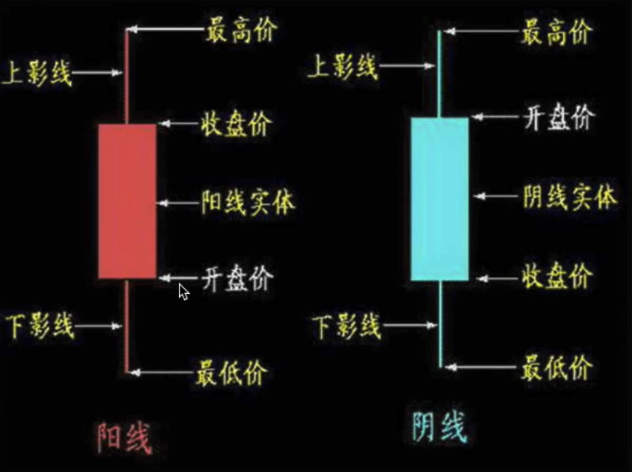
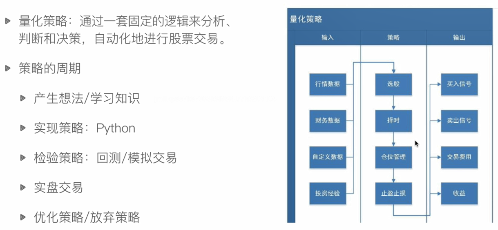

# 金融、股票知识入门

#### 基本金融知识介绍

- 金融：对现有资源进行重新整合之后，实现价值和利润的等效流通
- 金融工具：在金融市场中可交易的金融资产
  - 股票、期货、黄金、外汇、基金等

#### 股票

- 是股份公司发给出资人的一种凭证，股票的持有者就是股份公司的股东
- 股票的作用：
  - 出资证明、证明股东身份、对公司经营发表意见
  - 公司分红、交易获利
- 上市/IPO：企业通过证券交易所公开向社会增发股票以募集资金

#### 股票的分类

- 股票按业绩分类：
  - 蓝筹股：资本雄厚、信誉优良的公司股票
  - 绩优股：业绩优良的公司股票
  - ST股：特别处理股票，连续两年亏损或每股净资产低于股票面值
- 股票按上市地区分类：
  - A股：中国大陆上市，人民币认购买卖（T+1，涨跌幅10%）
  - B股：中国大陆上市，外币认购买卖（T+1，T+3）
  - H股：中国香港上市（T+0，涨跌幅不设限制）
  - N股：美国纽约上市
  - S股：新加坡上市

#### 股票市场的构成

- 上市公司
- 投资者
- 证监会、证券业协会、交易所
- 证券中介机构
- 交易所
  - 上海证券交易所：一个主板（沪指）
  - 深圳证券交易所：
    - 主板：大型成熟企业（深成指）
    - 中小板：经营规模较小
    - 创业板：尚处于成长期的创业企业

#### 影响股票的因素及股票买卖知识

- 公司自身因素
- 心理因素
- 行业因素
- 经济因素
- 市场因素
- 政治因素

#### 股票买卖（A股）

- 委托买卖股票
  - 个人不能直接买卖，需要在券商开户，进行委托购买
- 股票交易日：周一到周五（非法定节假日和交易所休市日）
- 股票交易时间：
  - 9:15 - 9:25      开盘集合竞价时间
  - 9:30 - 11:30    前市，连续竞价时间
  - 13:00 - 15:00  后市，联系竞价时间
  - 14:57 - 15:00  深交所收盘集合竞价时间
- T+1交易制度：股票买入后当天不能卖出，要在买入后的下一个交易日才能卖出
- 涨停、跌停限制

#### 金融分析

- 基本面分析
  - 宏观经济面分析：国家的财政政策、货币政策等
  - 行业分析
  - 公司分析：财务数据、业绩报告

- 技术面分析：各项技术指标
  - K线
  - MA（均线）
  - KDJ（随机指标）
  - MACD（指数平滑移动平均线）
  - ......

#### 金融量化投资

- 量化投资：利用计算机技术并且一定的数据模型去实践投资理念，实现投资策略的过程
- 量化投资的优势：
  - 避免人的主观情绪等，更加客观
  - 能同时包括多角度的观察和多层次的模型
  - 及时跟踪市场变化，不断发现新的统计模型，寻找交易机会
  - 在决定投资策略后，能通过回测验证其效果

#### 量化策略

