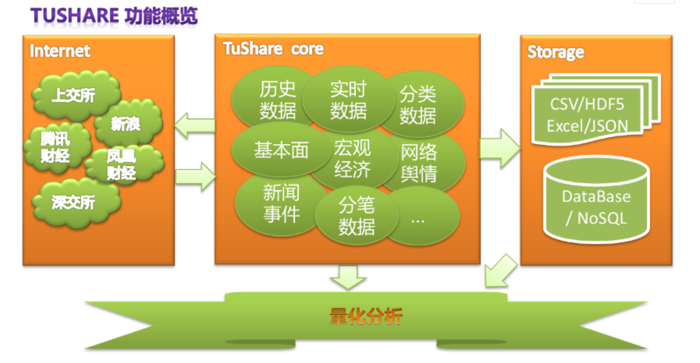
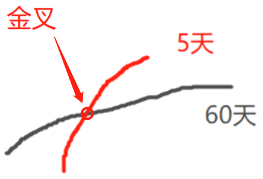

# 金融数据分析基础

[tushare包](http://tushare.org/)

>  Tushare是一个免费、开源的python财经数据接口包

### 练习1

- 使用tushare包获取某股票的历史行情数据
- 输出该股票所有收盘比开票上涨3%的以上的日期
- 输出该股票所有开盘比前日受怕跌幅超过2%的日期
- 假如我从2021年1月1日开始，每月第一个交易日以开盘价（收盘价也可以）买入1手股票，每年最后一个交易日卖出所有股票，到今天为止，我的收益如何？

### 练习2

#### 引入概念：

- 均线：对于每一个交易日，都可以计算出前N天的移动平均值，然后把这些移动平均值连起来成为一条线，就叫做N日移动平均线。移动平均线常用线有5天、10天、30天、60天、120天和240天的指标。
  - 5天和10天是短线操作的参考指标，称作日均线指标；
  - 30天和60天是中期均线指标，称作季均线指标；
  - 120天和240天是长期均线指标，称作年均线指标；

- 金叉：短期均线上穿长期均线，买入信号

  

- 死叉；短期均线下穿长期均线，卖出信号

#### 题目：

- 使用tushare包获取某股票的历史行情数据
- 使用pandas包计算改股票历史数据的5日均线和30日均线
- 使用matplotlib包可视化历史数据的收盘价和两条均线
- 分析输出所有金叉日期和死叉日期
- 假如我从2010年1月1日开始，初始资金为100000元，金叉尽量买入，死叉全部卖出，则到今天位置，我的炒股收益率如何？

