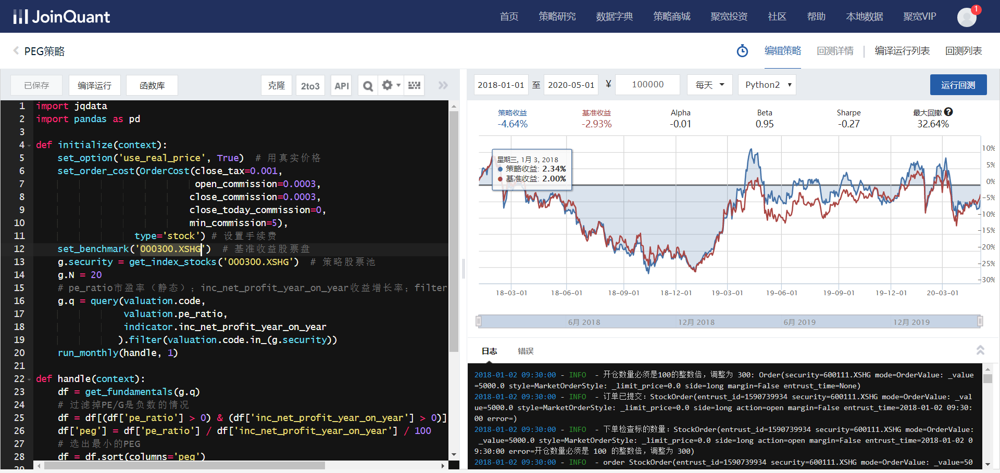
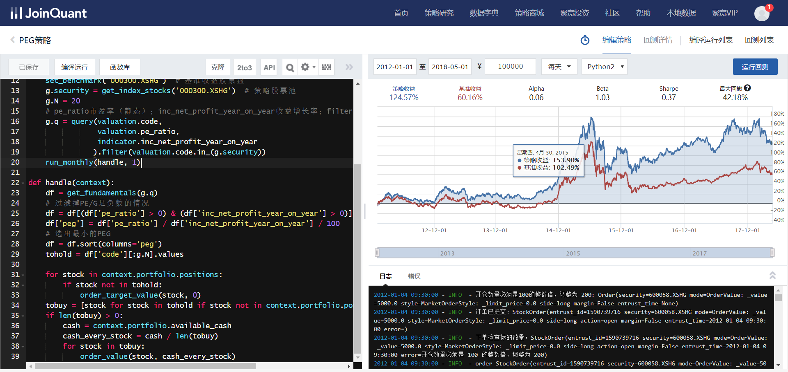

# PEG策略

### 概念

- 市盈率(PE) = 股价(P) / 每股收益(EPS)

- 市盈率 ≈ 市值 / 净收益

例如：A公司，每年净利润50万元，收购价（市值）为100万元；B公司，每年净利润100万元，收购价（市值）为1000万元；怎么确定买哪个公司的股票？

A公司市盈率 ≈ 100万 / 50万 ≈ 2

B公司市盈率 ≈ 1000万 / 100万 ≈ 10

由上可知：买A公司两年回本，买B公司10年回本，所以买A公司

- 收益增长率

$$
收益增长率(G)= (EPS_i - EPS_{i-1}) / EPS_{i-1}
$$

- i 表示一段时间，i-1表示上一段时间

- PEG = PE / (G * 100)
  - 一般情况下PEG是为1的，如果小了说明股价偏低或者被低估，涨的可能性越大
  - PEG是一个综合指标，既考察价值，也兼顾成长性。PEG估值法适合应用于成长型的公司

#### PEG策略（选股）：

- 计算股票池中所有股票的PEG指标
- 选择PEG最小的N只股票调仓
- 注意过滤叼市盈率或收益增长率为负的股票

### PEG策略实现

~~~python
import jqdata
import pandas as pd

def initialize(context):
    set_option('use_real_price', True)  # 用真实价格
    set_order_cost(OrderCost(close_tax=0.001,
                             open_commission=0.0003,
                            close_commission=0.0003,
                            close_today_commission=0,
                            min_commission=5),
                  type='stock') # 设置手续费
    set_benchmark('000300.XSHG')  # 基准收益股票盘（沪深300）
    g.security = get_index_stocks('000300.XSHG')  # 策略股票池（沪深300）
    g.N = 20
    # pe_ratio市盈率（静态）；inc_net_profit_year_on_year收益增长率；filter选出这些股票中前面需要的三列
    g.q = query(valuation.code,
                valuation.pe_ratio,
                indicator.inc_net_profit_year_on_year
               ).filter(valuation.code.in_(g.security))
    run_monthly(handle, 1)

def handle(context):
    df = get_fundamentals(g.q)
    # 过滤掉PE/G是负数的情况
    df = df[(df['pe_ratio'] > 0) & (df['inc_net_profit_year_on_year'] > 0)]
    df['peg'] = df['pe_ratio'] / df['inc_net_profit_year_on_year'] / 100
    # 选出最小的PEG
    df = df.sort(columns='peg')
    tohold = df['code'][:g.N].values
    
    # 下面进行交易买卖
    for stock in context.portfolio.positions:
        if stock not in tohold:
            order_target_value(stock, 0)
    tobuy = [stock for stock in tohold if stock not in context.portfolio.positions]
    if len(tobuy) > 0:
        cash = context.portfolio.available_cash
        cash_every_stock = cash / len(tobuy)
        for stock in tobuy:
            order_value(stock, cash_every_stock)
~~~

首次测试

> 结果并不如意，与基准收益几乎一样

我们再试下其它时间段

> 发现效果还行

这里我们知道，策略也存在时效性

