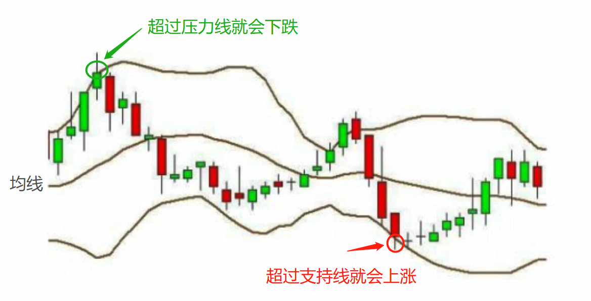
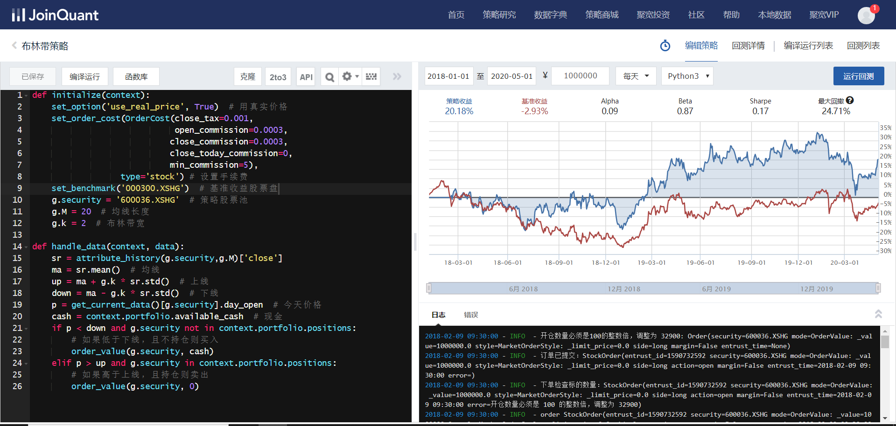
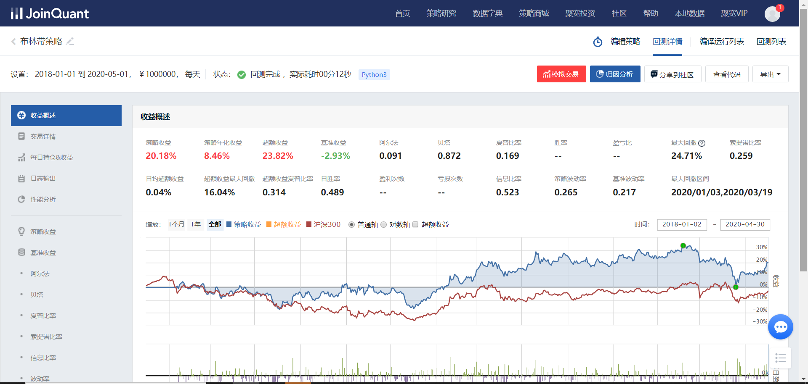

# 布林带策略

### 概念

由三条轨道线组成，其中上下线分别可以看成是价格的压力线和支撑线，在两条线之间是一条价格平均线。

#### 计算公式：

- 中间线 = 20日均线
- up线 = 20日均线 + N * SD(20日收盘价)
- down线 = 20日均线 - N * SD(20日收盘价)

#### 布林带策略：择时

- 当股价突破压力线（上线）时，清仓
- 当股价跌破支撑线（下线）时，全仓买入

**布林带策略研究：**N的取值问题（这里用20），布林带宽度（这里用2）等

### 布林带策略小试

在聚宽量化交易平台直接操作

~~~python
def initialize(context):
    set_option('use_real_price', True)  # 用真实价格
    set_order_cost(OrderCost(close_tax=0.001,
                             open_commission=0.0003,
                            close_commission=0.0003,
                            close_today_commission=0,
                            min_commission=5),
                  type='stock') # 设置手续费
    set_benchmark('000300.XSHG')  # 基准收益股票盘（沪深300）
    g.security = '600036.XSHG'  # 策略股票池
    g.M = 20  # 均线长度
    g.k = 2  # 布林带宽

def handle_data(context, data):
    sr = attribute_history(g.security,g.M)['close']
    ma = sr.mean()  # 均线
    up = ma + g.k * sr.std()  # 上线
    down = ma - g.k * sr.std()  # 下线
    p = get_current_data()[g.security].day_open  # 今天价格
    cash = context.portfolio.available_cash  # 现金
    if p < down and g.security not in context.portfolio.positions:
        # 如果低于下线，且不持仓则买入
        order_value(g.security, cash)
    elif p > up and g.security in context.portfolio.positions:
        # 如果高于上线，且持仓则卖出
        order_value(g.security, 0)
~~~

测试2018年-2020年5月的效果图片

如果策略收益比基准收益要高，可以认为策略是有效的，但是你只要细心的看，你就发现我留了个坑